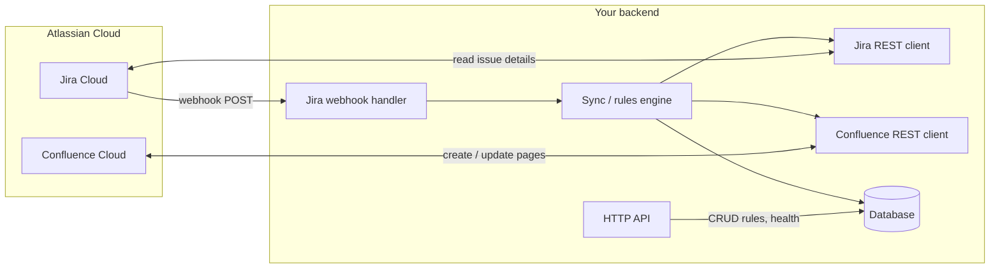

# Jira Confluencer Synchronizer — Architecture

This document describes how the system fits together, with **focus on the backend**. The app keeps **Confluence** documentation aligned with **Jira** by reacting to Jira events and calling Confluence APIs.

---

## 1. What the system does (one picture)



- **Inbound:** Jira sends **webhooks** when issues change (created, updated, transition, comment, etc.).
- **Core:** Your server **validates** the webhook, **loads rules** from the DB, decides **what to do**, then calls **Jira** (if you need extra fields) and **Confluence** (update or create content).
- **Outbound:** **Confluence REST API** updates pages (e.g. release notes block, status table).
- **Side:** A small **HTTP API** lets you (or a future UI) register **sync rules** and inspect **processed events** (idempotency, debugging).

---

## 2. Backend logical layers

Think in **four layers** (inside-out). Dependencies point **inward** (handlers → services → integrations; integrations do not import HTTP routes).

| Layer | Responsibility |
|--------|----------------|
| **Transport (HTTP)** | Express/Fastify routes: health, webhook endpoint, admin API for rules. Parse JSON, return status codes. **No business rules** beyond auth and validation shape. |
| **Application (services)** | “When issue X transitions to Done, append line to page Y.” Orchestrates: load rules → evaluate event → call Jira/Confluence clients → persist audit/idempotency. |
| **Integrations (clients)** | Thin wrappers around **Jira REST v3** and **Confluence REST**: auth headers, base URL, retries, typed responses. |
| **Persistence** | Rules, webhook delivery IDs, optional audit log. SQLite locally; Postgres in production. |

Optional **fifth** piece: a **queue** (BullMQ + Redis) if webhooks must return fast and work is heavy — **not required for MVP** if processing is quick.

---

## 3. Main data flows

### 3.1 Jira webhook (happy path)

1. Jira POSTs to `POST /webhooks/jira` with a signed or secret-validated payload.
2. **Verify** secret (query param or `X-Hub-Signature` if configured) and parse `webhookEvent`, `issue`, `changelog`.
3. **Idempotency:** if `webhookEvent` + issue id + timestamp (or Jira’s delivery id if present) already processed → **204** and exit.
4. **Rule matching:** find active rules for this Jira project + issue type + event type (e.g. `jira:issue_updated` + transition to status “Done”).
5. **Enrichment (optional):** `GET /rest/api/3/issue/{key}` if the webhook body is not enough.
6. **Confluence action:** e.g. append bullet to page via **Get page → update body** or **create page** from template.
7. **Persist:** mark event processed; append audit row (optional).

### 3.2 Admin / config API (for you or a future UI)

- `GET/POST/PATCH/DELETE /api/rules` — define which Jira project + trigger maps to which Confluence space/page.
- `GET /api/health` — process + DB + optional Atlassian ping.

---

## 4. Backend folder layout (recommended)

```
backend/
├── package.json
├── tsconfig.json
├── .env.example
├── src/
│   ├── index.ts                 # bootstrap server
│   ├── config/
│   │   └── env.ts               # zod/env validation
│   ├── http/
│   │   ├── app.ts               # create Express/Fastify app
│   │   ├── middleware/
│   │   │   ├── webhookAuth.ts   # validate shared secret / signature
│   │   │   └── errorHandler.ts
│   │   └── routes/
│   │       ├── health.ts
│   │       ├── webhooks.jira.ts
│   │       └── rules.ts
│   ├── services/
│   │   ├── syncService.ts       # orchestrates: match rules → act
│   │   └── ruleEngine.ts        # pure functions: does this event match rule?
│   ├── integrations/
│   │   ├── jira/
│   │   │   ├── jiraClient.ts    # axios/fetch + auth
│   │   │   └── types.ts
│   │   └── confluence/
│   │       ├── confluenceClient.ts
│   │       └── types.ts
│   ├── webhooks/
│   │   ├── parseJiraPayload.ts  # normalize Jira JSON to internal DTO
│   │   └── types.ts
│   ├── models/
│   │   └── User.entity.ts       # TypeORM entities → Postgres tables
│   └── persistence/
│       ├── data-source.ts       # TypeORM DataSource + init
│       └── repositories/
│           ├── rulesRepository.ts
│           └── processedEventsRepository.ts
└── tests/
    ├── ruleEngine.test.ts
    └── syncService.test.ts
```

**Frontend (later)** can live in `frontend/` as a Vite + React app calling `/api/*` — not part of backend architecture here.

---

## 5. Data model (minimal)

| Table / entity | Purpose |
|----------------|---------|
| **rules** | `id`, `name`, `enabled`, `jiraProjectKey`, `issueType` (optional), `trigger` (e.g. `transition_to:Done`), `confluenceSpaceKey`, `confluenceParentPageId` or `targetPageId`, `mode` (`append_release_line` \| `update_status_table`), timestamps. |
| **processed_webhooks** | `idempotency_key` (unique), `received_at`, `issue_key`, `result` (success/fail), optional error message. |

This lets you **prove** in an interview that you thought about **duplicate webhooks** and **configurable behavior**.

---

## 6. Authentication to Atlassian (backend)

Two practical modes:

| Mode | When to use | How |
|------|-------------|-----|
| **API token + email** | Solo dev, demo site | Basic auth or header; simplest for MVP. |
| **OAuth 2.0 (3LO)** | “Real app” story | User authorizes; store refresh token encrypted; production-like. |

The **same** Node process uses these credentials for **both** Jira and Confluence calls to the same Atlassian Cloud site (`https://your-site.atlassian.net`).

**Webhook URL** must be **HTTPS** in production (ngrok / cloud tunnel for local dev).

---

## 7. External APIs used (conceptual)

- **Jira Cloud REST API v3** — e.g. `GET /rest/api/3/issue/{issueIdOrKey}` for full issue, status, fields.
- **Confluence Cloud REST API** — e.g. create page, get page by id, update page body (ADF or storage format depending on API version you choose).

Your **clients** centralize base URL, auth, and error mapping (401 → config error, 429 → retry with backoff).

---

## 8. Cross-cutting concerns

| Concern | Approach |
|---------|----------|
| **Security** | Webhook secret in header/query; never log tokens; HTTPS only. |
| **Idempotency** | Store keys from Jira payload or hash(payload + issue key + event time). |
| **Observability** | Structured logs (pino), request id, correlation id per webhook. |
| **Failures** | Retry Confluence 429/5xx with backoff; dead-letter or failed row in DB for manual replay. |
| **Config** | All secrets via `process.env` / `.env` validated at startup (e.g. zod). |

---

## 9. Deployment (typical)

- **Container:** single Node image; `PORT` from env.
- **Process:** one web worker for MVP; add worker + Redis if you add a queue.
- **Database:** SQLite file for hobby; managed Postgres for production.

---

## 10. MVP vs later

| MVP | Later |
|-----|--------|
| One rule type: e.g. “on transition to Done → append to Confluence page” | Multiple triggers, templates, ADF-rich bodies |
| API token auth | OAuth 3LO |
| Sync webhook processing | Queue + worker |
| SQLite | Postgres |

---

## 11. Summary

The **backend** is a **Node HTTP service** with three responsibilities: **accept Jira webhooks safely**, **apply configurable rules**, and **call Jira/Confluence REST APIs** with **persistent rules and idempotency**. Everything else (React UI, Forge) is optional on top of this core.
